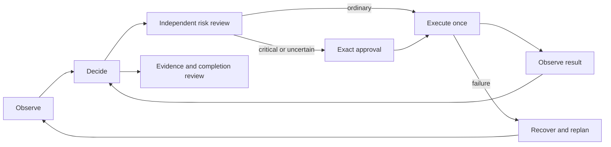

# Autonomous browser agent

A Python agent that uses a visible Playwright browser to solve natural-language tasks. LangGraph coordinates observation, native OpenAI tool calls, independent risk review, exact approvals, execution and recovery. The default model is **GPT-5.6 Luna**.

**Implementation and validation are in progress.** Deterministic browser, approval, budget and checkpoint tests are running; task evaluation results and the final video are not yet submission-ready. See [validation status](docs/VALIDATION.md).

## Start

```bash
uv sync --frozen
uv run playwright install chromium
cp .env.example .env.local  # only on a NEW checkout; preserve an existing configured file
chmod 600 .env.local
# Set OPENAI_API_KEY in .env.local using your editor.
uv run browser-agent doctor
uv run browser-agent run --url 'https://example.com' 'Read this page and summarize what it offers.'
```

On the prepared machine, reuse `.env.local`; credentials and projects already exist. The application loads this filename explicitly and does not print keys. Python 3.12 and the pinned Chromium adapter are required. macOS is the tested platform; other operating systems have not been certified.

For an authenticated task, use a dedicated profile:

```bash
uv run browser-agent login 'https://your-service.example' --profile demo
uv run browser-agent run --profile demo 'Your task, including the service URL'
uv run browser-agent resume '<run-id>'
```

Log in manually in the opened browser, then press Enter in the terminal to close and save it. Only one process may own a profile. The prepared real-site profile is `demo`; close any previous launcher before reuse. Password controls are redacted and unavailable to the agent.

The terminal displays actual proposed tools, arguments, results and spending. A consequential action shows its destination, selected content and submitted values. Type `yes` to approve that exact action; anything else denies it. Denial ends the run as partial. At a clarification prompt, `/pause` saves and exits. Browser verification challenges pause automation and model calls until explicit continuation.

## How it works



The browser adapter exposes current accessibility references, bounded reading, screenshots, form controls, navigation and tabs. The model receives no arbitrary JavaScript, shell, cookies, site selectors or hidden fixture state. Routes and controls must be discovered from observations or supplied by the user.

Observations are paginated at 18 KB of UTF-8 text. The gateway counts the exact request, including tools and any current screenshot, and refuses inputs above 20,000 tokens. Six complete tool/result groups and bounded working notes are retained. User constraints remain separate from page data. The initial limits are 60 decisions, 2,048 output tokens per call and 20 minutes of active execution.

Every model request—including reviewers, evaluators and retries—uses a durable spending ledger. Each logical task is capped at **$5**; unknown billed attempts retain reservations. Only Luna currently has a verified price configuration. Model changes require explicit pricing support and evaluation. The local estimate uses a conservative cache-write premium; this is not an account-wide spending limit.

SQLite checkpoints store graph progress. A separate SQLite journal consumes approvals and records dispatch **before** browser effects. A restart cannot reset spending or reuse an approval. Uncertain effects require inspection; the agent can reconcile an effect only with observed evidence and independent review. It does not blindly repeat submissions.

## Validation

```bash
uv run ruff check .
uv run pytest tests -q
```

Follow [FINAL-TEST.md](docs/FINAL-TEST.md) for the ordered release checks. Paid evaluations require current successful deterministic reports, a configured LangSmith key/project/dataset, and an explicit aggregate allowance:

```bash
uv run python -m evals.release init --session final-candidate --max-total-usd 45
uv run browser-agent doctor --online --budget-usd 5 --release-session final-candidate
uv run python -m evals.run --suite core --repetitions 1 --headed --max-experiment-usd 15 --release-session final-candidate
uv run python -m evals.report --release-session final-candidate --require-final-suite
```

The three core fixtures preserve the semantics of the supplied mail, food and job tasks. Their data and state graders are separate from the runtime. Synthetic approvals are constrained to the registered fixture origin and exact permitted effects. Real browser state, recorded submissions, approval chronology and an independent factual evaluator determine task results. A generated “done” response is insufficient.

Real-account graph and provider traces are disabled even when `LANGSMITH_TRACING=true`. Evaluations export only isolated synthetic runs to LangSmith. Local profiles, checkpoints, event logs and screenshots remain private under Git-ignored `artifacts/`.

## Limits and source material

Risk assessment combines code-enforced invariants with a nonacting model reviewer. It cannot prove arbitrary websites honest or guarantee avoiding bot checks. Unknown effects require human input. Canvas-only controls, arbitrary coordinate clicks, uploads/downloads, MCP and Claude support are outside this implementation. Real-site compatibility must be reported separately from fixture performance.

The preserved [Russian assignment](docs/assignment.ru.md), [HR criteria](docs/hr-requirements.ru.md), [reference screenshots](docs/assets/ideal-solution-01.jpg), [design](docs/SYSTEM-DESIGN.md), [research](docs/LANGGRAPH-RESEARCH.md) and [setup record](docs/SETUP.md) explain the requirements and decisions. Original design documents describe intended release gates; [validation status](docs/VALIDATION.md) records what has actually been run.

Repository: https://github.com/Nordup/sp-solution-test-assignment. Work directly on **main**; do not create another branch or worktree.
