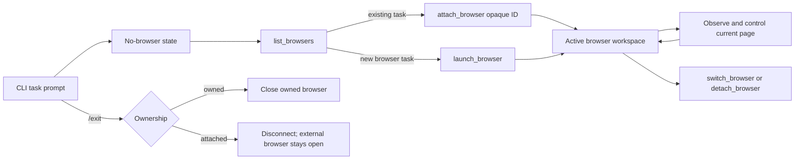
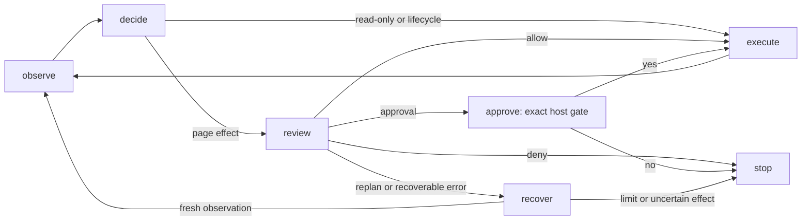

# Architecture

The [assignment](assignment.ru.md) and [HR criteria](hr-requirements.ru.md) require a visible, autonomous browser agent with generic navigation, bounded context, structured model calls, recovery and safety checks. The runtime keeps those concerns in one LangGraph actor and lets the task determine how a browser is obtained. The selected advanced patterns are adaptive error handling and a narrow security layer for real side effects.

## Browser workspace

`BrowserWorkspace` starts with zero browser records. The bare `uv run browser-agent` command opens the terminal task prompt without choosing a browser, URL or account. The model receives the no-browser state and uses native workspace tools to inspect connectable local browsers, launch an owned Chromium, attach to a discovered browser, switch the active browser or detach one. Page tools always operate on the selected active browser.

The first owned browser uses the persistent `default` profile under `artifacts/profiles/default`; additional owned browser records use separate workspace profiles. An attached browser is external: its existing context and tabs are preserved, cookies are not copied, and the workspace only disconnects from it on `/exit` or explicit detach. Only Chromium with an enabled local CDP endpoint is attachable through the current Python Playwright adapter.

## Local browser discovery

Discovery intentionally has a narrow trust boundary. On macOS and Linux the host inspects local browser listeners with `lsof`, then verifies each candidate through its local `/json/version` endpoint. Only verified connectable CDP endpoints become opaque IDs in `list_browsers`; raw endpoints are not sent to the model. The adapter does not perform a broad port scan or scrape raw process command lines.

`attach_browser` accepts only an ID returned by the current discovery result. Playwright connects through Python `connect_over_cdp`; a normal Chrome or Firefox process without remote debugging is not magically attachable. ChromeMCP extensions or channels are separate integrations and are not implemented here.

## Runtime shape

Python 3.12, LangGraph `StateGraph`, native OpenAI Responses function calls validated by Pydantic, Playwright and Rich terminal input. The runtime model is `gpt-5.6-luna` with low reasoning effort. LangSmith remains a dependency for explicit tracing boundaries; live tasks disable tracing and do not export account content automatically.

Once a browser is active, one LangGraph loop connects observation, a typed model decision, technical host guards, an independent `review` node, execution and recovery. The reviewer uses the same Gateway and budget ledger at medium reasoning effort while the actor remains at low effort. Browser lifecycle and observation capabilities can use technical guards; every page-changing action is reviewed semantically with the current host-resolved target and effect. The typed reviewer returns `allow`, `approval`, `replan` or `deny`: an allow executes, approval enters the existing exact host gate, replan returns bounded feedback to a fresh observation, and deny stops. Deleting a message, sending a message, submitting an application, placing or paying for an order and similar external effects still require exact approval. The reviewer is a narrow safety component, not a general multi-agent framework or second planner. The model receives no site-specific selectors, navigation recipes or expected task answers.

The review packet contains the full task, trusted user clarifications and the exact host-resolved operation, destination, target and form values. Page text, model notes, recent tool results and other page-controlled prose are marked untrusted and bounded; the reviewer receives no private chain of thought. Strict Pydantic function schemas reject prose or malformed JSON. Stale references trigger a fresh observation; incomplete technical context stops safely or requests a safer clarification. Provider, budget or time failures stop or recover within the configured bound without replaying an effect.

## Requirement decisions

| Requirement | Implementation |
|---|---|
| Visible browser and text interaction | The bare CLI provides the terminal task prompt. `launch_browser` creates visible Chromium; `attach_browser` brings a verified existing Chromium context under observation. Tool arguments, results, approvals and the final report are shown in the terminal. |
| Model-driven browser choice | The workspace starts empty. The actor chooses discovery, attach or launch from the task wording and current browser state; there is no deterministic initial browser, startup URL or selection menu. |
| Persistent sessions | The first owned Chromium uses the persistent `default` profile; additional owned records use separate workspace profiles. Attached Chromium keeps its existing context and tabs. Cookies are never copied between profiles or browsers. |
| Local endpoint discovery | `list_browsers` returns only opaque IDs for local listeners found with `lsof` and verified through `/json/version`; no broad port scan, raw endpoint or command-line text is exposed to the model. |
| Ownership and exit | Owned browsers are closed on `/exit`; attached browsers are disconnected and left running. `switch_browser` changes the active browser and `detach_browser` releases an attached one without closing it. |
| Generic navigation | No startup URL, selector, workflow recipe or expected answer is supplied. After browser selection, the actor chooses an HTTP(S) homepage or search engine with `navigate`, verifies the result and discovers site routes from current page content. |
| Browser controls | Native tools cover browser discovery/ownership plus `navigate`, `new_tab`, `tabs`, `switch_tab`, `close_tab`, `back`, `forward`, `reload`, `hover`, vertical and horizontal `scroll`, reads, screenshots, forms, keyboard input, questions and reports. |
| Structured model interaction | Native strict function schemas plus Pydantic validation are used. The runtime does not parse JSON from model prose with regular expressions. |
| Bounded context | The actor receives a bounded current accessibility snapshot, scoped or paged reads, ten recent tool exchanges and a cumulative factual notebook required in every tool call (up to 6,000 characters). |
| Security layer and critical-action confirmation | Technical guards cover capability and protocol boundaries; every page-changing action goes to an independent structured reviewer with host-resolved operation, destination, target and form values. `allow` executes ordinary reversible work, `approval` enters the exact affirmative gate showing destination, values and action, `replan` requests fresh evidence, and `deny` stops. Deleting, sending, submitting an application, placing or paying for an order and similar external effects require approval. Every reload is reviewed; the reviewer judges whether the current form action/method could resubmit work. The browser revalidates the target before dispatch. |
| Adaptive recovery | Provider errors use bounded backoff/retry; browser errors trigger a fresh observation and new decision; stale references and stale review details are rejected. An unavailable reviewer or uncertain classification stops safely, and repeated failure produces an honest partial or failed report. |
| Advanced patterns | The implementation uses adaptive error handling plus the narrow independent security-review node above. It does not add a general fleet of specialized sub-agents or a second autonomous planner. |
| Uncertain side effect | If an action may already have taken effect, the actor stops for inspection instead of automatically replaying it. |
| Login or challenge | Passwords and credentials are not model tools. Login, CAPTCHA and security challenges pause for manual handling in the visible browser. |
| Cost | The runtime enforces a maximum $5 model budget per task across actor calls, independent security-review calls and retries. Unknown billed attempts consume the conservative estimate. |
| Acceptance | Focused automated tests cover the graph, browser adapter, context, safety and retry boundaries. Human acceptance uses the same CLI with task-only existing-browser and new-browser scenarios plus the three assignment tasks. |

## Deliberate limits

An external browser must already expose a local remote-debugging endpoint. An ordinary running Chrome or Firefox cannot be attached just because it is open, and the agent does not copy cookies or manufacture a CDP endpoint. The current adapter supports Python Playwright `connect_over_cdp`; ChromeMCP extension/channel support is outside scope.

Discovery is supported on macOS and Linux through verified local `lsof` listener records and `/json/version` responses. It does not scan arbitrary ports or inspect raw process command lines. A browser that is not returned by `list_browsers` must be launched with the required debugging configuration or used manually.

The default profile is exclusive to one owned process. Arbitrary program checkpoint resume, exactly-once execution across crashes and production operation accounting are outside this assignment. After an uncertain consequential operation, inspect the browser and private event log before starting another task.

The agent is designed for the assignment's live-account acceptance scenarios, but no live service can be certified universally. Login/security challenges, native dialogs, file selection and account-specific checkout blockers may require manual handling. The two read-only model smokes cover owned launch and external attachment, and the focused lifecycle checks pass; live-account scenarios remain separate review work recorded in [VALIDATION.md](VALIDATION.md).

## Code map

- `cli.py` opens the terminal session, prompts for tasks and handles `/exit`.
- `agent.py` owns one task lifecycle in `run_task`.
- `workspace.py` implements browser discovery, ownership and active-browser routing; `browser.py` implements the Playwright page adapter and actions.
- `graph.py` defines the observe/decide/review/approve/execute/recover loop.
- `safety.py` applies capability and protocol guards and builds the independent review packet; `tools.py` defines native workspace, page and review schemas.
- `prompts.py` and `context.py` construct bounded model input.
- `llm.py` handles the OpenAI client and retries; `budget.py` enforces the per-task spending cap.
- `telemetry.py` records private local events. Live tracing is disabled by default.

## Technical references

The browser adapter follows Playwright's CDP connection contract and closes owned browser resources according to its ownership state:

- [Playwright `connect_over_cdp`](https://playwright.dev/python/docs/api/class-browsertype#browser-type-connect-over-cdp)
- [Playwright browser close](https://playwright.dev/python/docs/api/class-browser#browser-close)
- [LangGraph graph API](https://docs.langchain.com/oss/python/langgraph/use-graph-api)
- [Playwright persistent contexts](https://playwright.dev/python/docs/api/class-browsertype#browser-type-launch-persistent-context)

The independent review shape follows the documented behavior of [Codex auto-review](https://learn.chatgpt.com/docs/sandboxing/auto-review), [Cursor Auto-review](https://cursor.com/blog/agent-autonomy-auto-review) and [Claude permission modes](https://code.claude.com/docs/en/permission-modes). The pinned Codex guardian policy template at commit [`ddea03ad049142943bdbf13e937b1d67e8c1ba0c`](https://github.com/openai/codex/blob/ddea03ad049142943bdbf13e937b1d67e8c1ba0c/codex-rs/core/assets/guardian/policy_template.md) is a design reference; no vendor component is copied or claimed as a tested dependency.
