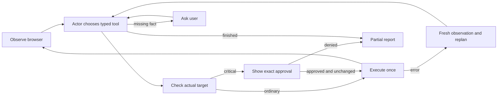

# Architecture

The [assignment](assignment.ru.md) and [HR criteria](hr-requirements.ru.md) define the requirements below.

## Stack and flow

Python 3.12, a small LangGraph `StateGraph`, native OpenAI Responses function calls validated by Pydantic, Playwright, Rich/terminal input, and LangSmith for synthetic evaluations. The runtime uses one acting model: `gpt-5.6-luna`.

## Requirement decisions

| Requirement | Implementation |
|---|---|
| Visible browser and text interaction | Headed Playwright browser beside a real terminal; actual tool arguments, results and final report are displayed. |
| Persistent sessions | Dedicated Playwright profile; user logs in manually. One process owns a profile at a time. |
| Autonomous multi-page decisions | One model repeatedly chooses a typed tool from the latest observation. LangGraph controls transitions. |
| Generic navigation | Tools use references discovered from current accessibility snapshots. Runtime has no mail/order/job recipe, site selector or expected route. |
| Structured model interaction | Native strict function schemas plus Pydantic validation. No regex extraction of JSON from model prose. |
| Bounded context | Current bounded snapshot, scoped/paged reads, ten recent tool exchanges and a cumulative notebook required in every tool call (up to 6,000 characters). The notebook records facts and progress; it does not require another model call. Older raw snapshots leave context. |
| Critical-action confirmation | Host policy examines the actual target/form; shows destination, values and proposed action. Exact affirmative response is required, and the browser revalidates the target before dispatch. |
| Adaptive recovery | Transient model errors use bounded backoff; stale references trigger a fresh observation and a new decision. Repeated failure stops honestly. |
| Uncertain side effect | Stop for human inspection rather than automatically repeating a potentially completed mutation. |
| Login or challenge | Pause automated interaction for manual handling. Credentials are not model tools. |
| Cost | Maximum $5 per task, including model retries. Estimate before dispatch and reconcile reported usage; unknown billed attempts consume the conservative estimate. |
| Evaluation | Three supplied task families on isolated local fixtures, focused failure tests, and LangSmith results. Fixture answers never enter the actor prompt. |

## Deliberate limits

Confirmation is conservative: an unknown JavaScript button or a consequential form submission requires approval. Browser-resolved search forms, menu expansion and local selection can run autonomously; critical labels override that exemption. The gate is not a proof of arbitrary website JavaScript behavior. Manual review of the displayed destination and content matters.

Browser login persists between runs. Resuming an arbitrary interrupted program checkpoint, exactly-once execution across crashes, and production operation accounting are outside this assignment. An uncertain consequential operation must be inspected before starting another task.

The actor verifies the latest browser state and writes a concise final report. Its final factual notebook is included as report details, preserving concrete item identities even when the summary is brief. No additional runtime model audits the actor's memory, questions or report. Evaluations check actual fixture outcomes independently.

Synthetic success demonstrates the agent loop and controlled task behavior. It does not certify compatibility with every live service or bypass login/security challenges. Current results belong in [VALIDATION.md](VALIDATION.md).

The existing adapter is tested on macOS and uses a POSIX profile lock. Windows support is not certified.

## Code map

- `agent.py` owns the task lifecycle and cleanup; `graph.py` defines the decision loop.
- `browser.py` resolves observed element references and executes Playwright actions; `safety.py` classifies those actions for confirmation.
- `tools.py` defines native function schemas; `prompts.py` and `context.py` construct bounded model input.
- `llm.py` handles the OpenAI client and retries; `budget.py` enforces the per-task spending cap.
- `cli.py` provides terminal interaction; `telemetry.py` records private local events.

## Technical references

LangGraph makes state transitions explicit without requiring a hosted service or checkpoint database. Native OpenAI function calls and Pydantic provide structured arguments. Playwright supplies persistent browser profiles and visible interaction. LangSmith stores synthetic evaluation results independently of the live agent.

- [LangGraph graph API](https://docs.langchain.com/oss/python/langgraph/use-graph-api)
- [Playwright persistent contexts](https://playwright.dev/python/docs/api/class-browsertype#browser-type-launch-persistent-context)
- [LangSmith code evaluators](https://docs.langchain.com/langsmith/code-evaluator-sdk)
