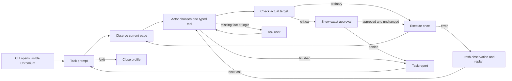

# Architecture

The [assignment](assignment.ru.md) and [HR criteria](hr-requirements.ru.md) require a visible, autonomous browser agent with generic navigation, bounded context, structured model calls, recovery and safety checks. This implementation keeps those concerns in one small LangGraph actor.

## Runtime shape

Python 3.12, LangGraph `StateGraph`, native OpenAI Responses function calls validated by Pydantic, Playwright and Rich terminal input. The runtime model is `gpt-5.6-luna` with low reasoning effort. LangSmith remains a dependency for explicit tracing boundaries; live tasks disable tracing and do not export account content automatically.

The bare `uv run browser-agent` command opens visible Chromium before the first task prompt. It owns the persistent `default` profile for the whole session, runs one task at a time in that browser, and accepts another task after the report. `/exit` closes the browser. Manual login can happen in the visible browser at any point; the profile keeps the resulting cookies for later tasks.

## Requirement decisions

| Requirement | Implementation |
|---|---|
| Visible browser and text interaction | The bare CLI command opens headed Playwright Chromium before `Task:`; the terminal shows tool arguments, observed results, approvals and the final report. |
| Persistent sessions | One locked Playwright persistent profile at `artifacts/profiles/default` is reused for every task in the session. The user may log in manually; cookies remain available to later tasks. |
| Autonomous multi-page decisions | The actor repeatedly chooses one typed tool from the latest observation. LangGraph controls the observe → decide → execute loop and its recovery edges. |
| Generic navigation | No startup URL, selector, workflow recipe or expected answer is supplied. The actor chooses an HTTP(S) homepage or search engine with `navigate`, verifies the result and discovers site routes from current page content. |
| Browser controls | Native tools cover `navigate`, `new_tab`, `tabs`, `switch_tab`, `close_tab`, `back`, `forward`, `reload`, `hover`, vertical and horizontal `scroll`, reads, screenshots, forms, keyboard input, questions and reports. |
| Structured model interaction | Native strict function schemas plus Pydantic validation are used. The runtime does not parse JSON from model prose with regular expressions. |
| Bounded context | The actor receives a bounded current accessibility snapshot, scoped or paged reads, ten recent tool exchanges and a cumulative factual notebook required in every tool call (up to 6,000 characters). |
| Critical-action confirmation | Host policy examines the observed target and form, shows destination, values and proposed action, and requires an exact affirmative response. The browser revalidates the target before dispatch. |
| Adaptive recovery | Transient provider errors use bounded backoff; stale references trigger a fresh observation and new decision; repeated failure produces an honest partial or failed report. |
| Uncertain side effect | If an action may already have taken effect, the actor stops for inspection instead of automatically replaying it. |
| Login or challenge | Passwords and credentials are not model tools. Login, CAPTCHA and security challenges pause for manual handling in the visible browser. |
| Cost | The runtime enforces a maximum $5 model budget per task, including retries. Unknown billed attempts consume the conservative estimate. |
| Acceptance | Focused automated tests cover the graph, browser adapter, context, safety and retry boundaries. Human acceptance uses the same CLI with the three assignment tasks; no prepared site, fixture route or workflow script is part of product acceptance. |

## Deliberate limits

The confirmation gate is conservative: unknown JavaScript actions and consequential submissions require approval. Browser-resolved search forms, menu expansion and local selection can run autonomously unless their labels make them critical. The gate is a safety check, not proof of arbitrary website behavior; the displayed destination and content still require human review.

The default profile is exclusive to one process. The browser stays open between tasks, but arbitrary program checkpoint resume, exactly-once execution across crashes and production operation accounting are outside this assignment. After an uncertain consequential operation, inspect the browser and private event log before starting another task.

The agent is designed for the assignment's live-account acceptance scenarios, but no live service can be certified universally. Login/security challenges, native dialogs, file selection and account-specific checkout blockers may require manual handling. Current smoke evidence and pending manual acceptance are recorded in [VALIDATION.md](VALIDATION.md).

The adapter is tested on macOS and uses a POSIX profile lock. Windows support is not certified.

## Code map

- `cli.py` opens the visible persistent browser, prompts for tasks and handles `/exit`.
- `agent.py` owns one task lifecycle in `run_task`.
- `graph.py` defines the observe/decide/execute loop.
- `browser.py` resolves observed references and executes Playwright actions; `safety.py` classifies actions for confirmation.
- `tools.py` defines native schemas; `prompts.py` and `context.py` construct bounded model input.
- `llm.py` handles the OpenAI client and retries; `budget.py` enforces the per-task spending cap.
- `telemetry.py` records private local events. Live tracing is disabled by default.

## Technical references

LangGraph makes state transitions explicit without requiring a hosted service or checkpoint database. Native OpenAI function calls and Pydantic provide structured arguments. Playwright supplies persistent browser profiles and visible interaction. LangSmith is retained for the explicit private-tracing boundary.

- [LangGraph graph API](https://docs.langchain.com/oss/python/langgraph/use-graph-api)
- [Playwright persistent contexts](https://playwright.dev/python/docs/api/class-browsertype#browser-type-launch-persistent-context)
