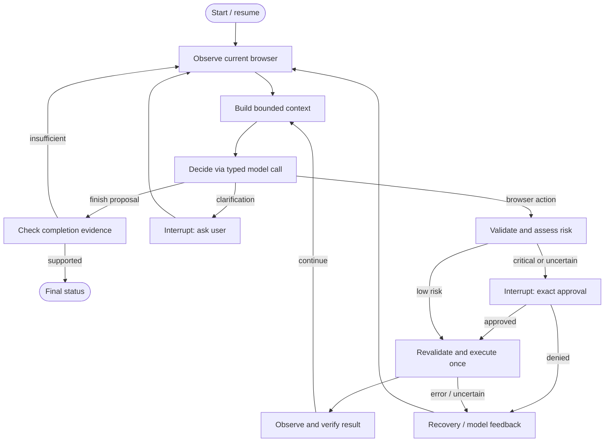

# LangGraph + Playwright: focused research and revised recommendation

Researched 2026-09-09 after the user clarified that they meant **LangGraph**, rather than LangChain. This document supersedes the earlier recommendation to omit LangGraph. It changes the proposed orchestration/persistence layer; browser tools, native OpenAI calls, safety policy, budgets and evaluation criteria from [the original analysis](IMPLEMENTATION-RESEARCH.md) remain applicable. This is a recommendation, not a claim that the user has approved or that implementation is complete.

## Recommendation

Use **Python + LangGraph StateGraph + native OpenAI Responses SDK + Pydantic + custom Playwright tools + local SQLite checkpoints + LangSmith**.

LangGraph and the native OpenAI SDK solve different problems. LangGraph controls execution and saved state; the SDK makes model requests. Playwright owns the browser. We do not need an OpenAI Agents Runner or LangChain `create_agent` inside the graph. LangGraph can be used without LangChain's high-level model/agent abstractions, although dependencies such as `langchain-core` may still be installed transitively. [LangGraph overview](https://docs.langchain.com/oss/python/langgraph/overview).

This is a better fit than my earlier assessment suggested. I initially grouped LangGraph with unnecessary deployment infrastructure. A small local StateGraph requires no hosted graph server, Redis or Postgres, and directly supports the pause/resume and inspectable control flow this assignment values. The tradeoff is learning its replay and state-update semantics correctly.

## Fit against HR requirements

| Requirement | What LangGraph supplies | What we must implement |
| --- | --- | --- |
| Autonomous cycle | Conditional edges and repeated node execution | Model chooses next action from observations; graph does not contain a site workflow |
| Structured interaction | Nodes can call any typed model/tool adapter | Strict OpenAI tool schemas and Pydantic validation |
| Human review | `interrupt()` and `Command(resume=...)` | Criticality assessment, concrete payload, denial enforcement and post-approval revalidation |
| Recovery | Retry policies and explicit recovery branches | Stale-ref handling, strategy changes, uncertain-action inspection |
| Persistent state | Checkpointer and stable task/thread identifier | Browser reattachment/reopening, invalidation of stale observations |
| Context | Explicit state and context-construction node | Bounded snapshots, history compaction, exact request budget |
| LangSmith | Graph traces and nested instrumented calls | State-based evaluation datasets, graders and redaction |
| $5 budget | A place in control flow to check admission | Authoritative persisted reservations and actual usage ledger |

A generic graph such as observe → decide → approve → act → verify does not violate the prohibition on scripted tasks. A graph with nodes such as find_previous_restaurant or apply_to_hh_job would encode task knowledge and should not exist in runtime code. This distinction is an interpretation of the [assignment](assignment.ru.md) and [HR clarification](hr-requirements.ru.md), not a special exemption offered by the framework.

## Proposed graph



Budget admission wraps **every paid call**, including calls inside the risk node or compaction helper. It is not only a graph node before the main model. Exhausted step, time or money limits route to an explicit terminal status. A loop of ten graph nodes consumes roughly ten graph supersteps per decision cycle: do not confuse LangGraph's recursion limit with our 60-decision budget. Set both deliberately.

One node owns each logical phase. Prefer the explicit Graph API over the Functional API here because reviewable transitions are a project benefit. Use a single sequential browser executor, not parallel ToolNode execution. A stock ToolNode is not forbidden; a custom executor is justified by exact approvals, live-ref validation, single-flight execution and uncertain outcomes. Do not bury an entire second autonomous runner inside `decide`.

## State and runtime separation

Checkpoint only serializable data: run ID, task/constraints, bounded model history, progress notes, observation metadata, pending typed action, risk result, approval request/decision, retry counts, evidence IDs and terminal status. Store artifacts separately and reference them by ID; avoid copying full screenshots and DOM dumps into every checkpoint.

Browser, BrowserContext, Page, locks and API/database clients belong to runtime dependencies outside checkpointed state. Inject a BrowserSession service through runtime context or node closures. Reconstruct it on application startup. Do not attempt to pickle Playwright objects. [Runtime configuration](https://docs.langchain.com/oss/python/langgraph/use-graph-api).

Use a stable `thread_id` mapped to the logical task ID, plus a dedicated profile ID. A resumed task retains the same budget. Save state to a local file with `AsyncSqliteSaver`; the research checked `langgraph==1.2.11` and `langgraph-checkpoint-sqlite==3.1.1`. Resolve and lock the final dependency set with the existing Playwright/model packages. [Checkpointer documentation](https://docs.langchain.com/oss/python/langgraph/checkpointers); [SQLite package](https://pypi.org/project/langgraph-checkpoint-sqlite/).

A browser profile preserves supported browser session data; a graph checkpoint preserves agent state. Neither recreates every transient tab/DOM/form state after a process restart. Reopen the profile, inspect current pages, establish a new browser generation, invalidate prior refs and pending approvals as appropriate, and replan. Never automatically navigate back to a potentially effectful URL just because it was in a checkpoint.

When the browser was kept open during a human pause, revalidate the target on resume anyway. Use an execute-node entry guard so a resumed checkpoint cannot skip freshness checks merely because it points directly to the action node.

## Approval and replay: the most important caveat

`interrupt()` pauses a node, but resumption starts that node again from the beginning. Therefore the approval node must be pure apart from the interrupt itself: display an already prepared proposal and validate the returned decision. No model call, browser click, budget charge or non-idempotent logging operation belongs before the interrupt. Keep the risk review in a preceding node and execution in a following node. Do not swallow the framework's interrupt in a broad exception handler. [Interrupt semantics](https://docs.langchain.com/oss/python/langgraph/interrupts).

Use synchronous checkpoint durability at critical boundaries. It reduces the window between committing state and executing the next node; it does not provide a transaction across SQLite and a remote website.

Example failure: a browser successfully sends an application, then the process crashes before recording success. On resume, LangGraph cannot know whether the external site accepted it. A node retry or historical replay might send it twice. Keep an authoritative action journal with a stable action ID and dispatch status, persisted before dispatch. An uncertain dispatch must return through observation/verification, not automatic replay. If the outcome cannot be established, ask the user and report uncertainty.

Keep the journal and budget ledger outside rewindable graph state as the authoritative records. Checkpoints may reference them, but replaying an older checkpoint must not restore an unspent budget or unconsumed approval. Disable historical replay against live accounts; use it only with clean fixtures. This is a project-specific safety design, not an exactly-once guarantee from LangGraph.

## Retries and adaptation

Use explicit exception predicates and small `RetryPolicy` limits for safe reads or provider calls. Every paid attempt must reserve budget independently, and SDK-level retries must not multiply graph-level retries. Do not attach a generic retry policy to browser mutation nodes. On an action error, return typed error/uncertainty state and route to recovery.

A provider retry repeats a request after a transient failure. An agent recovery changes strategy after inspecting new state. Both are required by our interpretation of HR's priorities; one does not replace the other. For example, stale ref → fresh snapshot → different observed target is useful adaptation, while retrying the same stale click three times is not. [Fault tolerance](https://docs.langchain.com/oss/python/langgraph/fault-tolerance).

The docs/search index currently contain some mixed version language around newer node timeout/error-handler APIs. The recommended core only depends on StateGraph, interrupts, checkpointers and RetryPolicy; verify any newer convenience API against the pinned package before use.

## LangSmith and evaluation implications

Keep the existing fixture datasets and objective graders. The graph adds useful trace boundaries: observe, context, decide, risk, approval, act, verify and recover. Use graph tracing plus `wrap_openai`/`traceable` so native SDK calls appear as children. No LangChain model wrapper is required. [Tracing LangGraph without LangChain](https://docs.langchain.com/langsmith/trace-with-langgraph).

Add graph-specific tests:

- Pause, close/reopen the SQLite saver, reconstruct the graph and resume the same task.
- Approval-node reentry makes no external effect; denial never reaches execution.
- Resume with changed DOM or restarted browser requires fresh observation/approval.
- Crash after dispatch does not replay the effect; journal remains authoritative.
- Historical checkpoint does not restore spent money or used approvals.
- Three transient read failures are bounded; browser mutation nodes are never blindly retried.
- Active context stays bounded rather than appending messages indefinitely through a reducer.

LangSmith experiment success still depends on actual fixture state, not on reaching the graph's END node.

## Capability probe actually run

A no-LLM, no-browser synthetic probe tested the proposed LangGraph primitives using the exact versions above. It closed and reopened the SQLite saver, reconstructed the graph, resumed approval, exercised denial and verified bounded retries. It did not restart the operating-system process; it does not prove browser recovery or crash safety.

[Probe source](research/langgraph_checkpoint_probe.py). Executed with:

```bash
uv run --no-project --with langgraph==1.2.11 --with langgraph-checkpoint-sqlite==3.1.1 python /tmp/langgraph_assignment_probe.py
```

The saved script has the same contents; substitute its repository path to reproduce. Output:

```json
{"sqlite_reopen_resume": true, "denial_prevents_effect": true, "approval_node_reentered": true, "bounded_retry_verified": true, "calls": {"approval_entries": 4, "effects": 1, "read_attempts": 3}}
```

The four approval-node entries confirm that each of the approved/denied nodes entered once before pausing and again on resume. Only one synthetic effect ran. The separate [Playwright probe](research/PLAYWRIGHT-PROBE.md) verified snapshot/ref behavior. These are isolated capability checks, not an integrated autonomous-agent evaluation. No paid model calls were made.

## Net tradeoff and handoff changes

Compared with a handwritten loop, LangGraph adds dependencies, graph state/reducer rules and replay semantics. In return, it removes much custom pause/resume plumbing and gives a clear, traceable representation of the safety/recovery lifecycle. For this assignment, those benefits justify a small graph.

Compared with OpenAI Agents SDK, LangGraph is lower-level orchestration. We write more of the model/tool protocol, but can explicitly route approvals, revalidation, uncertain outcomes and recovery without nesting runner behavior. Compared with LangChain `create_agent`, the graph provides more direct control over these boundaries at the cost of writing the nodes ourselves.

Update the original plan by replacing the handwritten outer loop with `graph.py` and explicit nodes; use SQLite checkpointers for graph state while retaining `journal.py` and `budget.py` as authoritative non-rewindable records. Add no hosted runtime, second agent framework or task-specific subgraphs. All source, $5, main-only, privacy, evaluation and demo requirements remain in force. The user has requested research; runtime implementation has not started.
