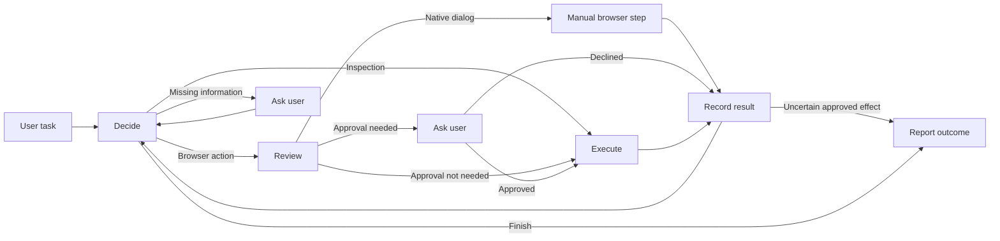

# Architecture

One actor chooses browser actions. LangGraph coordinates execution, an independent model reviews consequential actions, and Playwright CLI controls visible Chrome. The runtime contains no site-specific workflows, routes, or selectors.

## Agent loop

The [graph](../src/browser_agent/graph.py) has five nodes: `decide`, `review`, `approve`, `execute`, and `record`. Nodes return LangGraph `Command` updates with explicit destinations. Each decision produces a native function call whose arguments are validated with Pydantic. Model prose is not parsed into actions; each tool result is recorded once.

| Actor tool | Purpose |
| --- | --- |
| `playwright(command, args)` | Run one supported browser command. |
| `read_browser_artifact(path, offset)` | Read a bounded text excerpt or generated image. |
| `search_browser_artifact(path, query)` | Search saved browser output without changing element references. |
| `ask_user(question, kind)` | Request missing information or manual login/security help. |
| `finish(status, summary, remaining)` | Report the observed outcome. |

Each task has its own history and budget and reuses the browser session. The actor discovers controls from current observations, inspects substantive content, and checks the identity and count of selected items before bulk changes. These are general instructions, not task recipes.

## Browser and page representation

[The browser transport](../src/browser_agent/browser/session.py) invokes `@playwright/cli@0.1.19` using argument arrays without a shell. The host validates commands and supplies session, profile, and display settings. The packaged [browser skill](../src/browser_agent/playwright_skill.md) documents the available commands.

Screenshots provide visual orientation; snapshots, `find`, and focused DOM queries provide readable content and current element references. A scoped snapshot replaces the active references, so acting outside that scope requires a fresh snapshot or `find`. Reading a saved artifact does not refresh references.

Text output over 12,000 characters is saved as an artifact. The actor can read 12,000-character excerpts or search for up to ten matches within 6,000 characters of output. Artifact access is restricted to generated browser files up to 12 MiB. The reviewer receives a separate, bounded excerpt of fresh browser evidence around the proposed target. Fresh action snapshots update that evidence; old artifact reads do not.

The default persistent profile is `artifacts/profiles/default`. `open` reuses a compatible browser already owning that profile; without a URL it preserves the page. Explicit attachment also supports named Playwright sessions, CDP, or the Playwright extension. Session exit closes owned browsers and detaches from borrowed ones. Persistent login state survives application restarts; the running task graph does not have restartable checkpoints.

## Approval boundary

[The reviewer](../src/browser_agent/safety.py) classifies the proposed command's immediate effect using its arguments and up to 6,000 characters of browser evidence. It returns a schema-validated approval boolean. Pure inspection bypasses classification; `eval` is always reviewed because JavaScript can have side effects. Routine browsing and reversible preparation proceed automatically. Purchases, submissions, deletion, sensitive disclosure, and security changes are intended to require approval.

The host binds an affirmative answer to the exact pending request and command. A decline skips that action. If classification fails, the host requests a human decision. Fresh accessibility snapshots and tab lists are fingerprinted before and after the answer; changed or unavailable state prevents dispatch and returns control to the actor for inspection.

Native dialog text is unavailable through the pinned CLI. A `dialog-accept` proposal therefore asks the user to handle the dialog in the browser; the host does not execute acceptance. The actor inspects the result afterward.

Page content is untrusted evidence and cannot grant permission. Classification is model-based, and the state comparison observes the browser without locking the website or inspecting hidden server state.

## Context, limits, and recovery

[The context builder](../src/browser_agent/context.py) pins the original task and preserves native response items, including opaque reasoning and matching tool results. Server-side Responses compaction replaces older history with an opaque item while retaining subsequent output in order. Every request includes the current host-local date and UTC offset so relative dates can be checked against observed dates.

| Setting | Default |
| --- | --- |
| Actor / reviewer | `gpt-5.6-luna`, max / medium reasoning |
| Shared task model budget | $5 maximum |
| Input token cap / compaction threshold | 200,000 / 150,000 |
| Maximum response output | 32,768 tokens |
| Active time allowance | 20 minutes, excluding human input |
| Transient provider retries | Two retries with bounded backoff |

The model client counts input tokens and reserves budget before generation. Unknown usage retains its reservation. `cost_usd` is conservative budget accounting; `reported_cost_usd` estimates cost from reported usage. Supported models require a configured price table.

Invalid function calls receive bounded validation feedback. Ordinary browser errors return to the actor, which can inspect the current page and choose another action. Browser commands are not automatically replayed. An uncertain result after an approved action stops the task to avoid duplicating its effect; the user checks the outcome before continuing.

Double Esc cancels a task and leaves the browser usable. Cancellation cannot undo an action already dispatched. There is no graph-step cap; the active deadline bounds model work, while browser subprocesses have no separate overall timeout.

## Data handling

| Destination | Data |
| --- | --- |
| OpenAI | Task, instructions, tool results, requested images, and reviewer evidence. |
| Local artifacts | Events, diagnostics, browser output, screenshots, and persistent profiles. |
| Optional LangSmith tracing | Usage, estimated cost, latency, and status; no task text, page content, tool arguments, or human replies. |

Tracing failures do not stop browser work. Credentials, profiles, and private artifacts are ignored by Git and excluded from the package.

## Design references

- [Official Playwright CLI documentation](https://github.com/microsoft/playwright-cli/blob/655530f6d0dc71a0d6bf46ae165877d3c7311099/README.md) and [skill](https://github.com/microsoft/playwright-cli/blob/655530f6d0dc71a0d6bf46ae165877d3c7311099/skills/playwright-cli/SKILL.md): browser interface.
- [Codex reviewer policy](https://github.com/openai/codex/blob/968835997714baaff199cfed5f89a2c65d8ca77d/codex-rs/core/assets/guardian/policy_template.md) and [Claude Code auto mode](https://www.anthropic.com/engineering/claude-code-auto-mode): effect-based approval design.
- [LangGraph state and nodes](https://docs.langchain.com/oss/python/langgraph/thinking-in-langgraph) and [Command routing](https://docs.langchain.com/oss/python/langgraph/graph-api#command): explicit graph transitions.
- [OpenAI reasoning handoff](https://developers.openai.com/api/docs/guides/reasoning#preserve-reasoning-without-stored-responses): native response history.
