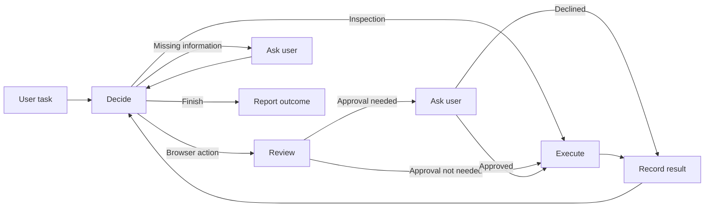

# Architecture

One actor chooses browser actions. LangGraph coordinates execution, an independent model classifies actions for approval, and Playwright CLI controls the browser.

## Agent loop

The graph has five nodes: `decide`, `review`, `approve`, `execute`, and `record`. Each model decision produces one native function call. Pydantic validates its arguments before dispatch; model prose is not parsed into actions.

The actor has four tools:

| Tool | Purpose |
| --- | --- |
| `playwright(command, args)` | Run one supported CLI command with literal arguments. |
| `read_browser_artifact(path, offset)` | Read a generated text or image file. |
| `ask_user(question, kind)` | Request missing information or manual login/security help. |
| `finish(status, summary, remaining)` | Report the observed outcome. |

A new task starts with its own history and budget while reusing the browser session. The actor chooses its starting page and workflow from the request.

## Browser integration

[PlaywrightCLI](../src/browser_agent/browser_cli.py) invokes `@playwright/cli@0.1.19` as a subprocess with JSON output. This CLI release depends on Playwright `1.63.0-alpha-2026-08-31`. The runner passes argument arrays without a shell and validates the command and supported flags. The host supplies the session, profile, and display settings.

Playwright owns element references, navigation, waiting, tabs, snapshots, and browser attachment. The [browser skill](../src/browser_agent/playwright_skill.md) tells the actor how to use these capabilities. It can discover controls with `find` or `snapshot`, act on current references, and request screenshots when visual inspection is useful.

Browser output is returned through native tool results. Generated text files can be read in 12,000-character excerpts with a continuation offset. Artifact reads are limited to browser output directories, supported file types, and files up to 12 MiB. Screenshots requested by the actor are delivered as image content.

The host also caches up to 1,000,000 characters of recent browser evidence, including generated snapshots, locally for the reviewer. It selects a bounded excerpt around the proposed action's target. This cache is not automatically added to actor input. The host does not insert extra screenshot calls before or after actions.

A named Playwright session lives across tasks. The default profile is `artifacts/profiles/default`. The actor may open an owned browser or attach through Playwright's session, CDP, or extension support. Shutdown attempts to close an owned browser or detach from an external one.

## Approval boundary

[The reviewer](../src/browser_agent/safety.py) receives the proposed command, its arguments, and up to 6,000 characters of current browser evidence. It returns only `needs_approval: true | false`.

Inspection commands bypass the classifier. Navigation and other commands are reviewed for their immediate effect; classification alone does not ask the user for approval. Purchases, submissions, deletion, sensitive disclosure, and security changes are intended to require approval; routine browsing and reversible preparation continue automatically.

When approval is required, the host presents a short question with `[y/N]`. An affirmative answer must match the pending request ID before the exact command is dispatched. A decline produces `skipped_by_user` and returns control to the actor. If classification fails, the host asks the user to decide.

Page content is untrusted evidence. It cannot grant permission or change the reviewer policy. Classification is model-based, however, and is not a guarantee that every consequential action will be identified. Approval binds to a command, not a locked website state: changing the page while approval is pending can change the command's effect.

## Context, limits, and recovery

The [request builder](../src/browser_agent/context.py) pins the original task and retains native tool history. Server-side Responses compaction replaces older history with an opaque item that is carried into the next request. A browser profile persists; the running graph does not have restartable checkpoints.

Defaults are defined in [Settings](../src/browser_agent/config.py):

| Setting | Default |
| --- | --- |
| Actor / reviewer | `gpt-5.6-luna`, max / medium reasoning |
| Shared task model budget | $5 maximum |
| Input admission cap | 200,000 tokens |
| Compaction threshold | 150,000 tokens |
| Maximum response output | 32,768 tokens |
| Model decisions per task | 60 |
| Active time allowance | 20 minutes, excluding human input |
| Retries for transient provider failures | 2 after the first attempt |

The gateway counts input tokens and reserves budget before generation. Failed attempts with unknown usage retain their reservation. `cost_usd` reports conservative budget accounting; `reported_cost_usd` estimates cost from reported usage. Neither is an invoice. An unsupported model is rejected because it has no configured price table.

Transient API failures use bounded backoff. Invalid model calls receive validation feedback within a retry limit. Browser commands are never automatically replayed: their actual errors return to the actor, which can inspect the page and choose another action.

The active deadline is checked between decisions and bounds model waits. Browser subprocesses have no separate overall timeout. Double Esc cancels the current task, saves a partial result, and leaves the session available. An already dispatched action may have taken effect.

## Data handling

| Destination | Data |
| --- | --- |
| OpenAI | Task, instructions, tool results, requested images, and approval-review evidence. |
| Local artifacts | Events, model diagnostics, results, browser output, screenshots, and persistent profile data. |
| LangSmith, when enabled | Model usage, cost estimates, latency, graph spans, and status. |

Task text, page content, tool arguments, user answers, and diagnostic captures are excluded from LangSmith export. Automatic graph tracing is disabled. Detailed diagnostics remain file-only even with `--debug`; tracing failures do not stop browser work.

Credentials and artifacts are ignored by Git. Local logs and profiles can contain account data and are not part of the handoff.

## Code map

| Files | Responsibility |
| --- | --- |
| [cli.py](../src/browser_agent/cli.py), [terminal.py](../src/browser_agent/terminal.py), [presentation.py](../src/browser_agent/presentation.py) | Session lifecycle, input, cancellation, and terminal output. |
| [agent.py](../src/browser_agent/agent.py), [graph.py](../src/browser_agent/graph.py) | Task lifecycle and decision loop. |
| [browser_cli.py](../src/browser_agent/browser_cli.py) | CLI transport, browser ownership, and artifact delivery. |
| [tools.py](../src/browser_agent/tools.py), [prompts.py](../src/browser_agent/prompts.py), [playwright_skill.md](../src/browser_agent/playwright_skill.md) | Native tool schemas and actor instructions. |
| [safety.py](../src/browser_agent/safety.py) | Classification and human approval. |
| [context.py](../src/browser_agent/context.py), [llm.py](../src/browser_agent/llm.py), [budget.py](../src/browser_agent/budget.py) | Requests, compaction, provider retries, and spending limits. |
| [config.py](../src/browser_agent/config.py), [telemetry.py](../src/browser_agent/telemetry.py) | Settings, local records, and optional tracing. |

## Design references

The [official Playwright CLI documentation](https://github.com/microsoft/playwright-cli/blob/655530f6d0dc71a0d6bf46ae165877d3c7311099/README.md) and [skill](https://github.com/microsoft/playwright-cli/blob/655530f6d0dc71a0d6bf46ae165877d3c7311099/skills/playwright-cli/SKILL.md) informed the browser interface.

The approval design borrows effect-based assessment from [Codex's reviewer policy](https://github.com/openai/codex/blob/968835997714baaff199cfed5f89a2c65d8ca77d/codex-rs/core/assets/guardian/policy_template.md) and [Claude Code's auto-mode design](https://www.anthropic.com/engineering/claude-code-auto-mode). This application uses a smaller boolean classifier and its own host approval flow.
